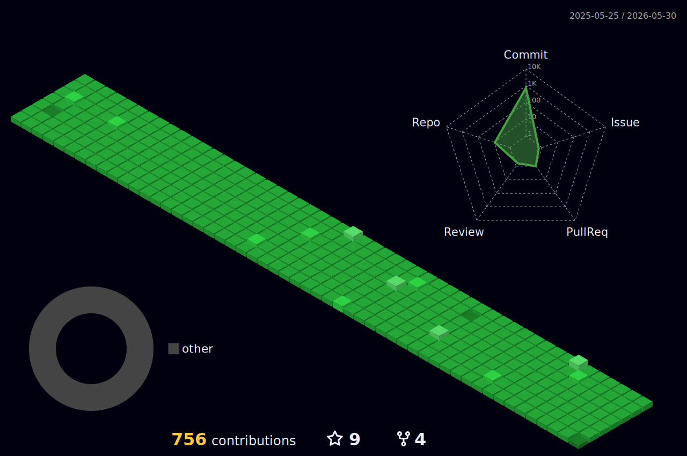

# `🏆` Trophy


# `📊` Statistic


# `🛬` Contributions

<a href="./profile-3d-contrib/profile-night-green.svg">
  
</a>

# `🚀` Docker deployment plan (Coolify)

1. Build and deploy this repository through Coolify using a `Dockerfile` source.
2. Add an HTTP health endpoint in the app (example: `/healthz`) and configure Docker health checks:
   ```dockerfile
   HEALTHCHECK --interval=30s --timeout=5s --start-period=20s --retries=3 \
     CMD wget -qO- http://127.0.0.1:${PORT:-3000}/healthz || exit 1
   ```
   > Use whichever HTTP client exists in your image (`wget` or `curl`) and install it in the Docker image if needed.
3. In Coolify, map the service domain and set the same health check path (`/healthz`) so failed containers are restarted automatically.
4. Use environment variables in Coolify for runtime configuration and secrets.
5. Enable auto-deploy from the default branch after successful build and health check.

# `🔔` Notifications: switch from Telegram to Discord

- Replace Telegram-based notifications with a Discord incoming webhook.
- Store the webhook in Coolify as `DISCORD_WEBHOOK_URL` (secret).
- Send deployment/build alerts from your CI workflow, Coolify post-deploy hook, or deployment script with a webhook POST payload:
  ```bash
  curl -X POST "$DISCORD_WEBHOOK_URL" \
    -H "Content-Type: application/json" \
    -d '{"content":"✅ Deployment succeeded"}'
  ```
- Optional: include environment, commit SHA, and health check status in the Discord message body.
